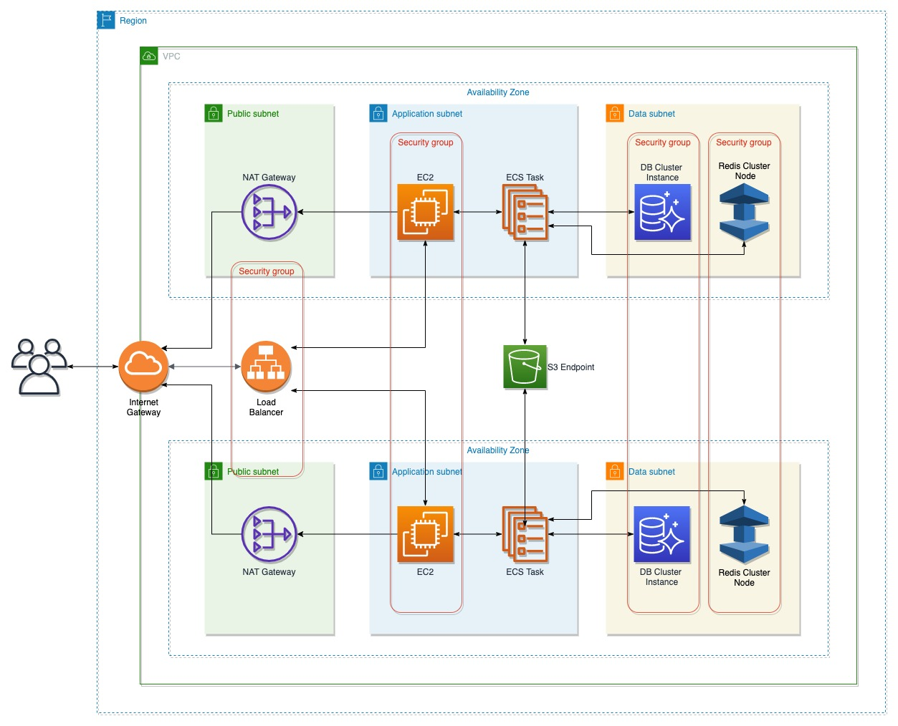

# CKEditor Collaboration Server On-Premise AWS ECS example

Use this script to provision infrastructure with recommended settings and install CKEditor Collaboration Server on your AWS account.

**Note**:
This script uses AWS CDK. If you haven't worked with it before, we highly recommend to get familiar with it first:
https://docs.aws.amazon.com/cdk/index.html

## Parameters
[Read more about AWS CDK context parameters](https://docs.aws.amazon.com/cdk/latest/guide/context.html)

- `dockerRegistryAuthToken` - Authentication token to `docker.cke-cs.com` repository
- `version` - Collaboration Server version (default `latest`)
- `env` - A comma-separated list of CKEditor Collaboration Server configuration ([see available options](https://ckeditor.com/docs/cs/latest/onpremises/cs-onpremises/installation/docker.html#docker-container-environment-variables))

## Quick start

To use AWS CDK first You need an AWS account and AWS credentials. Read more about how to configure the environment [on official CDK docs](https://docs.aws.amazon.com/cdk/latest/guide/work-with.html).

- install dependencies
```bash
	npm install
```

- [bootstrap CDK](https://docs.aws.amazon.com/cdk/latest/guide/bootstrapping.html) into your AWS account
```bash
	npm run -- cdk bootstrap
```

- deploy the application (replace `xxx` with your credentials).
```bash
	npm run -- cdk -c dockerRegistryAuthToken=xxx -c env=LICENSE_KEY=xxx,ENVIRONMENTS_MANAGEMENT_SECRET_KEY=xxx
```

**Note**:
For easier work with CDK, we recommend using it together with AWS credentials manager like [aws-vault](https://github.com/99designs/aws-vault).
## Infrastructure overview



To provide high availability and fault tolerance we're recommending running the application in at least two availability zones. For high security, we're following the least privilege model for all of the infrastructure resources - no permissions are given unless they are required. All of the data used by the system is encrypted.

### Autoscaling group
Running two EC2 C5 large instances across two availability zones. This gives enough CPU power and memory for handling up to 1000 concurrent users.

### Load balancer
Spread traffic evenly between servers. This is the only public (internet facing) component.

### ECS
Docker container orchestration for running the application and managing available EC2 resources.

### Database
Databases are running in an isolated network (no in/out internet access) with backup and encryption enabled.
MySQL (RDS Aurora) is running on R5 large instances.
Redis (ElastiCache cluster) is running on M5 large instances.

### S3
Private encrypted bucket for editor and easy image files.

### VPC
Including three subnets:

- public subnet for load balancer
- private subnet for application cluster
- isolated subnet for databases

### Autoscaling Group
To ensure high availability and fault tolerance, we're using at least two EC2 instances in different availability zones. We recommend using at least C5 large to provide good user experience.

- RDS Aurora cluster - large R5 instances
- ElastiCache Redis in cluster mode - medium T3 instance
- S3 bucket

To provide high-security standards we keep infrastructure resources in private/isolated subnets whenever it's possible. The data is encrypted in the bucket, as well as in the database and Redis.
