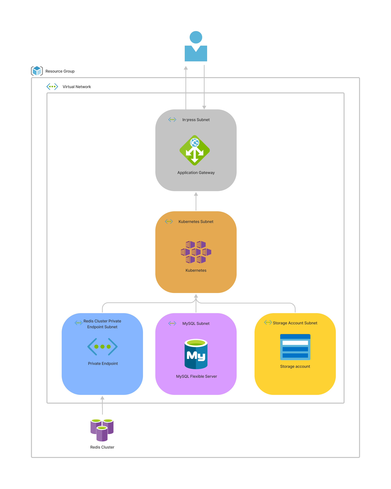

# CKEditor Collaboration Server On-Premises Azure Terraform modules

Use these Terraform modules to provision infrastructure hosted in Microsoft
Azure for Collaboration Server On-Premises. There are two modules: one for
provisioning the infrastructure needed to run the service, the other for
deploying deploying the service onto that infrastructure.

**Note**: These modules are made for Terraform. If you haven't worked with it
before, we highly recommend getting familiar with it first:
https://www.terraform.io/intro

## List of modules

Here is a short description of every module in this directory:

### [service](service)

A module provisioning Collaboration Server On-Premises on top of Azure AKS by
using a Helm chart. You can find more information about the used Helm chart
here: [kubernetes/helm/ckeditor-cs](/kubernetes//helm/ckeditor-cs/).

### [infrastructure](infrastructure)

The module is responsible for provisioning all elements of infrastructure
required to run Collaboration Server On-Premises on Microsoft Azure. It creates
the whole infrastructure in one dedicated resource group to separate it from the
rest of the resources in the Azure account.

## Quickstart

Check how can you utilize those modules in our [example](example-usage).

## Infrastructure overview

### Azure Virtual Network

A private network is hosted on Azure infrastructure. It contains five subnets
for different components:
- 10.0.0.0/22 AKS node pool
- 10.0.4.0/22 MySQL
- 10.0.8.0/22 Storage account
- 10.0.12.0/22 Redis private endpoint
- 10.0.16.0/22 Application Gateway

### Azure Private Endpoint

A network interface that privately connects the Redis Cache cluster to the Azure
virtual network.

### Azure AKS

This is a managed Kubernetes cluster hosted inside the virtual network with
Azure Log Analytics enabled. The cluster is configured with Application Gateway
for managed provisioning of an Ingress controller.

### Azure Redis Cache

Azure managed Redis database cluster accessible only through the Azure Private
Endpoint in the Virtual Network.

### Azure MySQL Flexible Server

An Azure-managed MySQL database cluster with automatic backups enabled. Backups
have retention configured to 7 days.

### Azure Application Gateway

Provisioned by the AKS integration load balancing service, this is a gateway
used for exposing Collaboration Server On-Premises outside the virtual network.

### Azure Storage Account and Container

A private encrypted blob storage managed by Azure.
