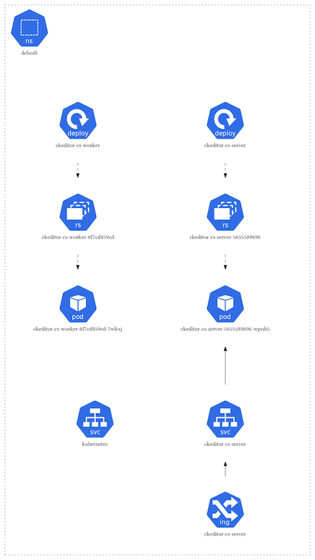

# CKEditor Collaboration Server On-Premises Helm charts

Use this Helm charts to provision CKEditor Collaboration Server on your
Kubernetes cluster.

**Note**: This script uses Helm. If you haven't worked with it before, we highly
recommend to get familiar with it first: https://helm.sh/docs/intro/quickstart/

## List of charts

Short description of every helm chart in this directory:

### [ckeditor-cs](ckeditor-cs)

Helm chart containing the resources to run CKEditor Collaboration Server
configured to connect to external third-party services.

### [ckeditor-cs-development-stack](ckeditor-cs-development-stack)

Fast way to provision whole infrastructure needed for CKEditor Collaboration
Server. Used charts as a dependencies:
- `ckeditor-cs`
- `bitnami/mysql`
- `bitnami/redis`

>:warning: **Not for production purposes!** This configuration is insecure, not
>persistent and its purpose is testing only.

## Quick start

Follow instructions from helm charts:
- [Production quick start](ckeditor-cs/README.md#quick-start)
- [Development quick start](ckeditor-cs-development-stack/README.md#quick-start)

## Configuration

Easier configuration management can be achieved by creating separate based on
`ckeditor-cs/values.yaml` configuration file. It can be passed to `helm install`
by `-f [path]` flag.

> :warning: **If you want to store configuration**: Make sure your environment
> variables are secure before saving them in external service. You can use
> [SOPS](https://github.com/mozilla/sops) for encrypting specific parts of yaml
> file.

Environment variables mentioned in configuration file are an absolute minimum to
run the service. Visit documentation for whole list of configuration options:

https://ckeditor.com/docs/cs/latest/onpremises/cs-onpremises/installation/docker.html#docker-container-environment-variables

## Infrastructure overview

### Pod

Individual instance of the CKEditor Collaboration Server container.

### Deployment

Manages provisioning pods, handles creating, replacing and scaling pods.

### Service

Abstract object that exposes a specific set of pods as a network interface. That
set if pods targeting is determined by selectors assigned to them.

### Ingress

Ingress manages external access to the service located in cluster. Creates
routing by hostnames and can handle terminating SSL/TLS.

### ServiceAccount

Automatically enabled authenticator in Kubernetes. Uses signed bearer tokens to
verify requests. Bearer tokens are mounted into pods.

### Secret

Storage and management of sensitive information. In this use case, environment
variables passed to the pods.

## Destroy installed chart
You can clean remove installed deployment from Kubernetes by running `helm
delete ckeditor-cs` command.
